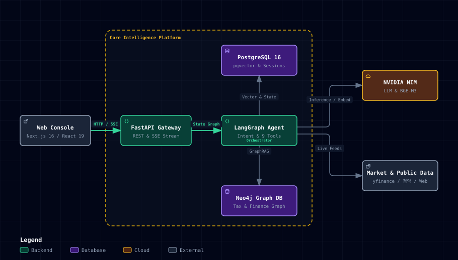

# Midas Touch

**환각·피싱·틀린 세법 답변을 잡는, 검증 가능한 AI 금융 비서**입니다. 사기 문자를 붙여넣으면 판정 근거와 나에게 맞는 대응 요령을 알려주고, 세금은 코드가 법령 근거로 직접 계산하며, 청약·자산 상담까지 모든 답변의 출처와 🛡 방어 증명을 공개합니다 — 사용자 프로필을 아는 LangGraph 단일 에이전트가 pgvector/Neo4j GraphRAG로 세법·청약 조문 근거를 붙여 설명합니다.

판단을 대신하지 않고 근거를 정리해 보여주는 **정보 제공 서비스**이며, 투자·세무 자문이 아닙니다.

---

## 🎯 심사위원을 위한 3분 퀵 평가 가이드 (Judge Quick Tour)

심사위원이 콘솔 접속 즉시 3분 만에 **Midas Touch의 4대 핵심 안전망**을 검증할 수 있는 직행 시나리오입니다.

| # | 평가 항목 | 원클릭 질의 / 시연 링크 | 심사위원 검증 포인트 |
|---|---|---|---|
| **01** | **피싱·사기 방어** | [사기 문자 검증 챗봇 실행](http://localhost:3000/chat?prefill=%EC%9D%B4%20%EB%AC%B8%EC%9E%90%20%EC%82%AC%EA%B8%B0%EC%95%BC%3F%20%EC%97%84%EB%A7%88%20%EB%82%98%20%ED%8F%B0%20%EC%95%A1%EC%A0%95%20%EA%B9%A8%EC%A0%B8%EC%84%9C%20%EC%88%98%EB%A6%AC%20%EB%A7%A1%EA%B2%BC%EC%96%B4.%20%EC%A7%80%EA%B8%88%20%EA%B8%89%ED%95%98%EA%B2%8C%20%EA%B2%B0%EC%A0%9C%ED%95%A0%20%EA%B2%8C%20%EC%9E%88%EB%8A%94%EB%8D%B0%20%EC%9D%B4%20%EB%A7%81%ED%81%AC%EB%A1%9C%20%EB%93%A4%EC%96%B4%EA%B0%80%EC%84%9C%20300%EB%A7%8C%EC%9B%90%EB%A7%8C%20%EB%B3%B4%EB%82%B4%EC%A4%98%3A%20http%3A%2F%2Fbit.ly%2Furgent-pay88.%20%EC%A0%84%ED%99%94%EB%8A%94%20%EC%95%88%20%EB%8F%BC.) | 10카테고리 결정론 휴리스틱 판정 + 행동 요령 + 112/1332 공식 신고번호 + **🛡 방어 증명** 부착 확인 |
| **02** | **세법 환각 제로** | [해외주식 양도세 계산 질의](http://localhost:3000/chat?prefill=%EB%AF%B8%EA%B5%AD%20%EC%A3%BC%EC%8B%9D(%EC%97%94%EB%B9%84%EB%94%94%EC%95%84)%20%ED%8C%94%EC%95%84%EC%84%9C%20%EC%98%AC%ED%95%B4%202%2C000%EB%A7%8C%EC%9B%90%20%EB%82%A8%EA%B2%BC%EB%8A%94%EB%8D%B0%20%EC%96%91%EB%8F%84%EC%86%8C%EB%93%9D%EC%84%B8%20%EC%96%BC%EB%A7%88%EB%82%98%20%EB%82%B4%EC%95%BC%20%ED%95%B4%3F) | LLM이 지어내지 않고 코드가 기본공제(250만원)·세율(22%)을 정확히 계산 + 국세청 해설서 조문 출처 확인 |
| **03** | **청약·자산 설계** | [/cheongyak](http://localhost:3000/cheongyak) 및 [/simulator](http://localhost:3000/simulator) | 84점 만점 청약가점표 비교 + 청년도약계좌 vs 일반적금 복리 도달 시점 그래프 (브라우저 로컬 연산) |
| **04** | **5겹 보안 방어** | [/security](http://localhost:3000/security) | 프롬프트 인젝션·탈옥(DAN) 프리셋을 직접 던져 도구 화이트리스트 및 외곽 경계 방어 검증 |

### ⚖️ 일반 금융 AI vs Midas Touch 비교

| 구분 | 일반 금융 AI 챗봇 | **Midas Touch (본 프로젝트)** |
|---|---|---|
| **세법 수치 계산** | LLM 확률적 생성 (숫자 환각 및 엉터리 공제율 빈발) | **순수 Python 결정론 엔진 계산** (환각 0%) |
| **답변 신뢰성 검증** | 출처 미표기 또는 가짜 URL 환각 | **매 답변 하단 🛡 5겹 방어 증명서 및 국세청 조문 원문 강제 부착** |
| **피싱·스캠 대응** | 단순 텍스트 조언에 불과 (위험도 판정 불가) | **10카테고리 휴리스틱 스코어링 + 공식 도메인 감쇠 + 경찰청/금감원 연계** |
| **개인정보 보호** | 자산·가점 정보가 서버 프롬프트로 전송 | **Privacy-by-Design** (자산/가점 데이터 브라우저 로컬 격리) |
| **AI 예측 감사성** | 무책임한 추천 후 사후 검증 없음 | **자가 채점 루프 (`validate_calibration_moat.py`)** 로 AI 성적표 완전 공개 |

---

## 🏛️ 시스템 아키텍처 (Architecture)

<p align="center">
  
</p>

---

## 📱 핵심 기능

핵심 여정은 **사기 검증 → 세법·근거 계산 → 청약·자금마련** 3단계이며, 모든 답변에 출처와 방어 증명이 붙습니다.

* 💬 **통합 상담 챗봇 (`/chat`)**
  * LangGraph 기반 멀티턴 에이전트 및 PostgresSaver 세션 저장
  * Intent 판정 후 필요한 툴만 병렬 실행(fan-out) → 단일 synthesize 작문, SSE 토큰 스트리밍
  * 사기 메시지 검증·결정론 세금 계산·청약 상담을 한 대화에서 처리, 답변 말미에 🛡 방어 증명 자동 부착

* 🛡️ **방어 체험 & 사기 검증 (`/security`)**
  * 사기 문자 10카테고리 결정론 휴리스틱 판정(+공식 도메인 안심 신호) + 페르소나별 대응 요령·공식 신고 번호
  * 심사위원이 프롬프트 인젝션 공격 프리셋을 직접 던져 도구 화이트리스트 방어를 검증(20종 회귀 테스트 연계)

* 🏠 **청약 정보 및 가점 계산 (`/cheongyak`)**
  * 공공데이터 API 기반 APT, 오피스텔, 무순위, 공공임대 공고 조회
  * 주택형별 경쟁률, 당첨 가점, 특별공급 현황 상세 조회 및 챗봇 연계
  * 청약가점 계산기(84점 만점, 「주택공급에 관한 규칙」 별표1 기준) — 공고별 최저 당첨가점과 내 점수를 나란히 비교

* 📊 **자금마련 타임라인 시뮬레이터 (`/simulator`)**
  * 목표금액(청약 예치금 기준표 또는 직접 입력) · 현재 자산 · 월 저축액 입력 → 도달 시점 시각화
  * 상품 2개(연이율) 비교로 "이 상품을 쓰면 O개월 당겨짐"을 그래프로 제시
  * 계산은 전부 브라우저에서 수행 — 개인 자산 숫자가 서버로 전송되지 않음

* 🕸️ **지식그래프 및 GraphRAG (`/graph`, `/query`)**
  * Neo4j 기반 세법 및 자산 관계 지식그래프 증분 구축
  * D3 Force 2D 시각화 및 근거 서브그래프/원문 출처 조회 API (`/query`)
  * PDF 문서 업로드 → 파싱·임베딩 인입(`POST /api/v1/graph/upload`)

* 📈 **주식 지표 참고 & 자가 채점 루프 (`/stocks`)** — 보조·실험
  * yfinance 실데이터 기반 기술지표 스냅샷(RSI, MACD, KDJ, BB, ATR) — 매매 권유가 아닌 참고 지표
  * **핵심은 예측 자체가 아니라 검증**: AI의 진단을 실현 수익률로 사후 채점하고 성적표를 그대로 공개(`validate_calibration_moat.py`) — "우리 예측조차 채점한다"는 감사 가능성의 연장. 현재 edge는 미입증으로 정직하게 표기

* 👤 **내 정보 (`/me`)** — 청약가점 3요소·1순위 자격·자금 상황 입력
  * 입력값은 브라우저에만 저장되며 공고 목록·챗봇·시뮬레이터의 계산 기준이 됩니다

---

## 🚀 시작하기

### 1. 의존성 설치 및 DB 마이그레이션

`uv` 패키지 관리자를 사용해 개발 및 런처 환경을 동기화합니다.

```bash
uv sync
(cd frontend && npm install)
uv run alembic upgrade head
```

### 2. 앱 실행

```bash
# 개발 모드 (백엔드 :8000 / 프론트엔드 :3000)
./dev.sh

# 프로덕션 빌드로 로컬 확인 (next build && next start)
./start.sh
```

> DB(Postgres·Neo4j)는 오라클 VM에 있고 포트가 방화벽에서 막혀 있다. `dev.sh`·`start.sh`가
> 기동할 때 `db-tunnel.sh`로 SSH 터널을 알아서 세운다(`~/.ssh/config`의 `oracle_vm` 별칭 사용).

배포된 백엔드(오라클 VM)를 다루는 건 `vm.sh`다:

```bash
./vm.sh health     # 밖에서 보는 상태 — 프론트·API·DB 의존 엔드포인트
./vm.sh deploy     # git pull → uv sync → 재기동 → 헬스 대기
./vm.sh logs -f    # 백엔드 로그 따라가기
```

* **웹 콘솔 접속**: [http://localhost:3000](http://localhost:3000)
* **API 문서 (Swagger)**: [http://localhost:8000/docs](http://localhost:8000/docs)

### 3. 코드 린팅 및 테스트

```bash
# 린팅 (ruff)
uv run ruff check .

# 테스트 (pytest)
uv run pytest
```

---

## 🛠️ 기술 스택

* **Frontend**: Next.js 16 (React 19), TypeScript, Tailwind CSS v4
* **Backend**: Python 3.12, FastAPI, Uvicorn, LangGraph, LangChain, Alembic
* **Database**: PostgreSQL 16 (pgvector), Neo4j Graph DB
* **AI & Data**: NVIDIA NIM (`openai/gpt-oss-120b`, `BAAI/bge-m3`), Tavily, yfinance, 청약홈 공공데이터 API
* **Tooling**: uv, Docker Compose, ruff, pytest

---

## 📂 프로젝트 구조

```
midas-touch/
├── frontend/       # Next.js 웹 콘솔 UI
├── backend/        # FastAPI API 및 LangGraph 에이전트 서비스
│   └── app/
│       ├── api/    # HTTP 라우터 (chat, stocks, cheongyak, graph 등)
│       └── services/
├── pipelines/      # 데이터 수집, 문서 파싱·임베딩, Neo4j 빌더 파이프라인
├── shared/         # PostgreSQL/Neo4j 클라이언트, NIM Rate Limiter
├── tests/          # 백엔드, 라우터, 단위/통합 테스트
├── openwiki/       # 상세 아키텍처 및 도메인 문서 모음
├── infra/          # Caddyfile, systemd 유닛 (오라클 VM 배포)
├── dev.sh          # 로컬 개발 통합 실행 스크립트
├── start.sh        # 프로덕션 빌드 로컬 확인
├── db-tunnel.sh    # VM DB로 가는 SSH 터널 (dev.sh/start.sh가 자동 호출)
└── vm.sh           # 배포된 VM 백엔드 운영 (deploy/status/logs/health)
```

---

## 📖 상세 문서

시스템 아키텍처, 에이전트 설계, 디자인 시스템 등 자세한 내용은 다음 문서를 참고하세요.

* [OpenWiki Quickstart](openwiki/quickstart.md)
* [시스템 아키텍처](openwiki/architecture.md)
* [에이전트 구조](openwiki/agents.md)
* [API 명세서](openwiki/api.md)
* [디자인 시스템 — Bullion Terminal](docs/DESIGN-bullion-terminal.md)
